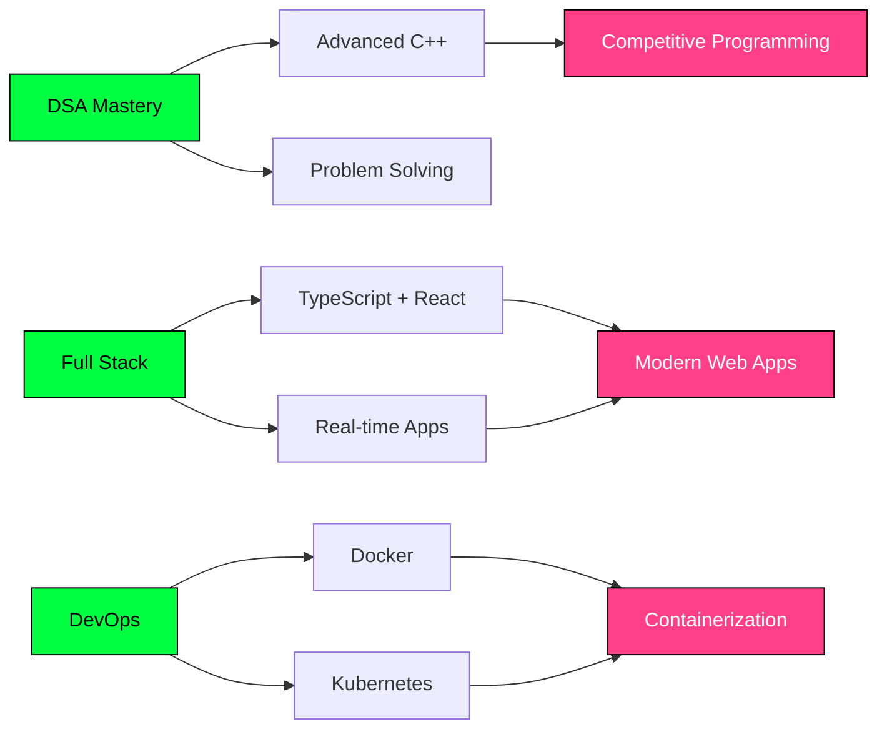

<div align="center">

#  Hey there! I'm Prince Kumar


</div>

## 🚀 About Me

```cpp
#include <iostream>
#include <vector>
#include <map>
using namespace std;

class Developer {
public:
    string name = "Prince Kumar";
    string location = "New Delhi, India 🇮🇳";
    string education = "BTech CSE - 2nd Year";
    string role = "Full Stack Developer & DSA Enthusiast";
    
    map<string, vector<string>> techStack = {
        {"languages",  {"C++", "JavaScript", "TypeScript", "Java", "Python", "C"}},
        {"frontend",   {"React.js", "Material UI", "HTML", "CSS", "Bootstrap", "Tailwind"}},
        {"backend",    {"Node.js", "Express.js", "Passport.js", "JWT Auth", "RESTful APIs"}},
        {"databases",  {"MongoDB", "Mongoose ODM", "MySQL"}},
        {"realtime",   {"Socket.io", "WebRTC"}},
        {"devops",     {"Docker", "Kubernetes"}},
        {"tools",      {"Git", "GitHub", "Postman", "VS Code", "Cloudinary", "Render", "Railway", "Vercel"}}
    };
    
    vector<string> currentFocus = {
        "Mastering Data Structures & Algorithms in C++",
        "Building scalable Full Stack applications",
        "Real-time apps with Socket.io & WebRTC 🎥",
        "Exploring DevOps: Docker & Kubernetes 🐳",
        "Open to Internship Opportunities 💼"
    };
    
    void display() {
        cout << "💡 Code is my canvas, logic is my brush" << endl;
        cout << "🧩 Every problem is a puzzle waiting to be solved" << endl;
        cout << "🌱 Learning, building, and growing every day" << endl;
    }
};

int main() {
    Developer prince;
    prince.display();
    return 0;
}
```

<div align="center">

### 💭 *"First, solve the problem. Then, write the code."*

</div>

---

## 🎯 What I'm Up To


- 🔭 Currently working on **Full Stack & Real-time Web Apps**
- 🧠 Sharpening my **DSA skills in C++**
- 🎥 Built **MeetInVirtual** — a WebRTC video conferencing platform
- 🐳 Exploring **DevOps** with **Docker & Kubernetes**
- 🌱 Learning **TypeScript** and advanced **React.js** patterns
- 💼 Looking for **internship opportunities** to apply my skills
- 🎓 2nd Year **BTech Computer Science** student
- ⚡ Fun fact: I debug faster after midnight 🌙

<br clear="right"/>

---

## 🛠️ Tech Arsenal

<div align="center">

### 💻 Languages


### 🎨 Frontend


### ⚙️ Backend & Database


### 🔌 Real-time & Communication


### 🐳 DevOps & Cloud


### 🔧 Tools & Platforms


</div>

---

## 🏗️ Featured Projects

### 🎥 [MeetInVirtual — Video Conferencing Platform](https://meet-in-virtual.vercel.app/)

[](https://meet-in-virtual.vercel.app/)
[](https://github.com/Princekr267/MeetinVirtual)

A production-ready **real-time video conferencing** platform built with the MERN stack, WebRTC, and Socket.io — supporting both authenticated users and guests.

**🔥 Key Features:**
- 🔐 **Authentication** — Email/password + Google OAuth, OTP-based password reset via email
- 🎥 **Video Calling** — Peer-to-peer WebRTC with camera & mic toggles (hardware released when off)
- 💬 **Live Chat** — Text messages, file sharing (up to 5 MB), chat history download
- 🤖 **AI Assistant** — `@ai` for quick answers, `#ai` to include full chat context (Google Gemini, streaming)
- 🎨 **Whiteboard** — Fabric.js canvas with pencil, shapes, text, eraser, undo/redo, PNG export;
- 😂 **Emoji Reactions** — Animated floating emojis broadcast to all participants
- 📌 **Pin Participants** — Focus any remote user's video full-screen
- 👑 **Host Controls** — Lock room, mute/video-off participants, kick, transfer host
- 📜 **Meeting History** — Past meetings with one-click rejoin

**🛠️ Tech Stack:**
```javascript
const techStack = {
    frontend:    ["React 19", "Material UI 7", "React Router 7", "Vite"],
    realtime:    ["Socket.IO", "WebRTC (RTCPeerConnection)", "STUN (Google)"],
    backend:     ["Node.js", "Express 5", "Passport.js (Google OAuth)", "Nodemailer", "Bcrypt"],
    database:    "MongoDB + Mongoose ODM",
    auth:        ["JWT / Crypto tokens", "Google OAuth 2.0", "OTP via Email"],
    ai:          "Google Gemini (streaming)",
    whiteboard:  "Fabric.js",
    deployment:  { frontend: "Vercel", backend: "Railway" }
};
```

---

### 🌍 [WanderLust — Property Listing Platform](https://wanderlust-r6m1.onrender.com)

[](https://wanderlust-r6m1.onrender.com)
[](https://github.com/Princekr267)

A full-stack **production-ready** property listing platform where users can browse, list, and review properties.

**🔥 Key Features:**
- 🔐 **Secure Authentication** — User login/signup with Passport.js
- 👥 **Role-Based Authorization** — Admin and user access controls
- 🏡 **Property Listings** — 10+ categories with detailed information
- ☁️ **Cloud Storage** — Image uploads via Cloudinary integration
- ⭐ **Review System** — Users can rate and review properties
- 📱 **Responsive Design** — Mobile-friendly Bootstrap UI

**🛠️ Tech Stack:**
```javascript
const techStack = {
    frontend:       ["EJS", "Bootstrap", "CSS"],
    backend:        ["Node.js", "Express.js"],
    database:       "MongoDB",
    architecture:   "MVC (Models, Views, Controllers)",
    authentication: "Passport.js",
    storage:        "Cloudinary",
    deployment:     "Render"
};
```

---

## 💪 DSA Journey

<div align="center">

### 🧩 Problem Solving Stats

[](https://leetcode.com/Princekr267)

**📊 Progress:** Actively solving problems and growing! 🚀

</div>

```cpp
// My DSA Approach
void solveProblem() {
    while(!understood) {
        read_problem();
        think_deeply();
    }
    
    while(!solved) {
        try_approach();
        if(works) {
            optimize();
            celebrate();
        } else {
            learn_from_mistake();
        }
    }
}
```

**🎯 Focus Areas:**
- Arrays & Strings
- Linked Lists & Trees
- Dynamic Programming
- Recursion & Backtracking
- Greedy Algorithms

---

## 📊 GitHub Analytics

<div align="center">
  


</div>

---

## 🏆 GitHub Trophies

<div align="center">


</div>

---

## 🎓 Current Learning Path

<div align="center">



</div>

| 🎯 Area | 📚 Focus | ✅ Status |
|---------|----------|-----------|
| **Data Structures** | Trees, Graphs, Dynamic Programming | In Progress 🔄 |
| **Web Development** | MERN Stack, TypeScript, Socket.io, WebRTC | Active 🚀 |
| **DevOps** | Docker, Kubernetes, Containerization | Exploring 🐳 |
| **System Design** | Scalable Architecture Patterns | Learning 🔍 |
| **Open Source** | Contributing to community projects | Planning 📝 |

---

## 💼 Open for Opportunities

<div align="center">

### 🚀 I'm actively seeking **internship opportunities** where I can:

✨ Apply my Full Stack & Real-time development skills  
🧠 Solve real-world problems with DSA  
🤝 Collaborate with talented teams  
📈 Learn and grow as a developer  

</div>

---

## 🤝 Let's Connect!

<div align="center">

[](https://www.linkedin.com/in/prince-kumar-27a12b315)
[](https://instagram.com/princekrr267)
[](https://leetcode.com/Princekr267)
[](mailto:princekrr267@gmail.com)

<br>

### 💬 Open to collaborations, project discussions, or just a chat about code!

**📧 Reach out:** princekrr267@gmail.com

</div>

---

<div align="center">

## 🌟 "Code is like humor. When you have to explain it, it's bad." – Cory House


### ⭐ If you like my work, consider starring my repositories!


</div>
